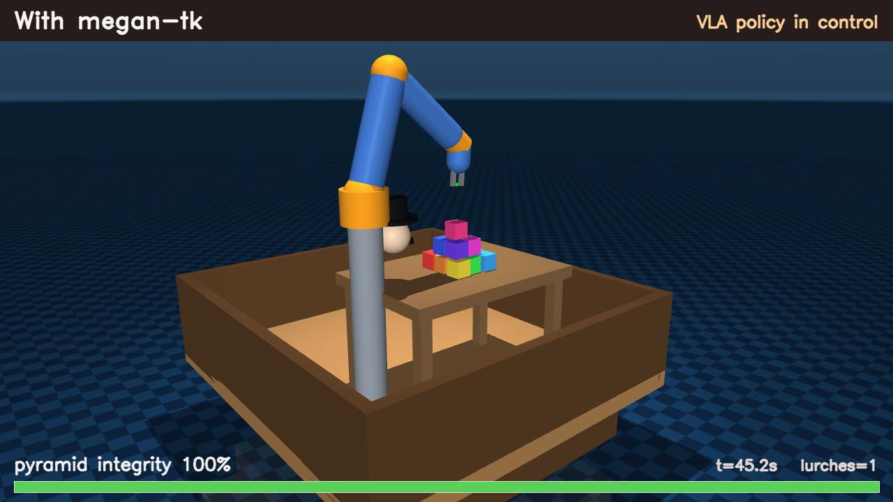

# 🎩 charliechaplinAI

> *A little tramp of a robot — bowler hat, mustache and all — alone on a rocking ship,
> trying to stack a tower of blocks before the next wave knocks it over.
> He falls. He watches. He learns a new trick. He keeps the tower standing.*

A 6-axis robot arm is bolted to the deck of a ship at sea. In front of it: **14
coloured blocks, scattered**. Its whole purpose in life is to build them into a
pyramid — a **3×3** base, a **2×2** middle, one proud block on top — and *keep it
standing* while the deck sways and the ocean keeps trying to ruin everything.

It's a balancing act worthy of the Little Tramp himself. And just like Chaplin, the
joy isn't that the robot is flawless — it's that it **figures it out as it goes.**

<!-- the show itself: click the still to play -->
[](media/demo.mp4)

▶️ **[Watch the demo](media/demo.mp4)** — the frozen robot vs. the one that learns
(100% vs 35% tower-still-standing).

```
            [#]            "...and the capstone, ladies and gentlemen!"
          [#][#]
          [#][#]
        [#][#][#]
        [#][#][#]
        [#][#][#]
   ___[🎩]_____________
  |   o  arm  table   |   <- one ship's deck, swaying...  and then — a LURCH!  ↩↪
  \___________________/
   ~~~~~~~~~ sea ~~~~~~~~~
```

## The comedy, in three acts

**Act I — It can't keep up.** A plain robot builds the tower just fine. Then a swell
rolls the ship, the top rows slide off into the sea, and it starts over. Another
wave. It starts over again. Sisyphus in a bowler hat — the pyramid spends its whole
life in pieces.

**Act II — It studies the sea.** Using megantk (the self-learning RLT using symbolic architectures), the robot can watch a few waves go by and then *learns the
rhythm* — when the next one is coming, before it arrives.

**Act III — It invents a new move.** It discovers it can **brace** — set a steadying
hand on the tower right before each wave — and *tries different ways of doing it*
until it finds the one that actually holds. Then it just... keeps the tower up.

> Plain robot: tower standing **~35%** of the time.
> Our hatted hero: **~100%**. Same arm, same storm — one of them *learned*.

## The actually-impressive part: it learns on the job 🧠

No retraining. No do-overs. Everything it knows, it picks up **live, on the rocking
deck, from what it sees:**

- 🏃 **How fast it can work** without toppling its own tower — it pushes the speed up
  until a build goes wrong, then settles on the fastest one that didn't.
- 🌊 **The rhythm of the waves** — learned from watching just a few of them, so it's
  ready *before* the next hit instead of being surprised by it.
- 🤚 **A brand-new trick** (the brace) that wasn't in its playbook — and it **works
  out the best way to do it** by trying options and keeping what holds the tower.
- 🤖 **A real little brain** drives every move: a small transformer **VLA policy**
  that reads the scene and decides, moment to moment, whether to *build*, *brace*, or
  *wait*. It learned that by watching a teacher — not from a pile of if-statements.

That's the Chaplin magic: drop him into a mess, and he adapts his way out of it.

## Run the show

Needs the cadenza venv (MuJoCo + torch + the Cadenza arm):

```bash
/Users/akshparekh/Documents/cadenza/.venv/bin/python run_demo.py
# options: --episodes N  --duration S  --no-render  --out DIR
```

It plays out the acts above and writes the film to `out/`: `demo.mp4` (the narrated
720p cut), `integrity.png` (the two "how-standing-is-the-tower" curves), and
`results.json`. To re-teach the little brain from scratch: `python train_policy.py`.

## Under the hood

The learning is powered by [`megan-tk`](../megantk) — four small "governors" running
on a live robot with no retraining: one **diagnoses** why it's failing (the deck is
*oscillating*), one finds the **max safe speed**, one **learns the wave rhythm**, and
one **discovers the brace** and picks the best version of it. A trained transformer
policy turns all that into the arm's actual decisions.

And it's all **real physics** — real friction grasps, a real rolling deck, real waves
that really topple things, and a real trained policy. No strings, no fillers: the
robot really is balancing that tower. 🎩
